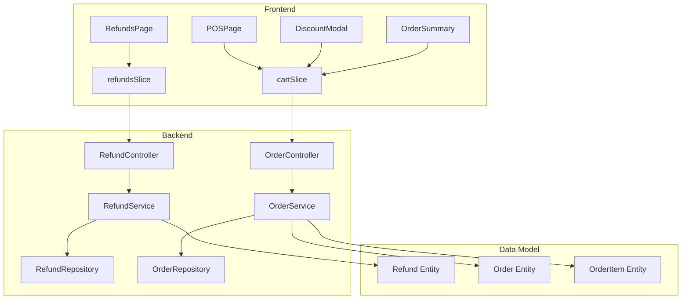

# Design Document: Refund & Discount Management

## Overview

The Refund & Discount Management feature extends the Enterprise SaaS POS/ERP Application with comprehensive refund processing and discount application capabilities. The feature is split into two major components:

1. **Refund Management**: A dedicated interface for viewing, filtering, and creating refunds for completed orders
2. **Discount Management**: Enhanced POS checkout flow with order-level and item-level discount application

The backend Refund API is already implemented (RefundController, RefundService, RefundDTO, Refund entity). This design focuses on:
- Frontend architecture (React 19 + Redux Toolkit)
- POS UI modifications for discount application
- Backend extensions to Order/OrderItem entities for discount persistence
- Integration with existing shift reporting and order management systems

**Technology Stack:**
- Frontend: React 19, Redux Toolkit, React Router 6
- Backend: Spring Boot 4.1.0, JPA/Hibernate
- State Management: Redux Toolkit with async thunks
- UI Components: Custom component library (Button, input classes)

## Architecture

### System Components



### Key Design Decisions

1. **Redux Slice Extension**: Enhance existing `refundsSlice` with additional thunks for filtering operations
2. **Discount State Management**: Add discount state to `cartSlice` to calculate totals before order creation
3. **Modal-Based Discount UI**: Use modal overlays for discount application to avoid cluttering POS interface
4. **Backend Entity Extension**: Add discount fields to Order and OrderItem entities (non-breaking changes)
5. **Access Control**: Leverage existing role-based routing and component-level checks


## Components and Interfaces

### Frontend Components

#### 1. RefundsPage Component

**Location**: `frontend/src/pages/RefundsPage.jsx`

**Purpose**: Main page for viewing and creating refunds

**Props**: None (uses Redux for state management)

**State Management**:
- Fetches refunds from Redux store
- Local state for filter controls (cashier, branch, shift, date range)
- Local state for modal open/close and selected order

**Key Features**:
- Table display with columns: Refund ID, Order ID, Amount, Reason, Cashier Name, Timestamp, Payment Type
- Filter controls: Cashier dropdown, Branch dropdown, Shift dropdown, Date range picker
- "Create Refund" button opens RefundModal
- Real-time updates when new refunds are created

**Component Structure**:
```jsx
function RefundsPage() {
  // Redux selectors
  const refunds = useSelector(s => s.refunds.items);
  const user = useSelector(s => s.auth.user);
  
  // Local state
  const [filters, setFilters] = useState({ cashierId: null, branchId: null, shiftId: null, startDate: null, endDate: null });
  const [modalOpen, setModalOpen] = useState(false);
  
  // Effects
  useEffect(() => { dispatch(fetchRefunds(filters)); }, [filters]);
  
  // Render table + filters + modal
}
```


#### 2. RefundModal Component

**Location**: `frontend/src/pages/RefundsPage.jsx` (inline) or `frontend/src/components/refunds/RefundModal.jsx`

**Purpose**: Modal for creating a new refund

**Props**:
- `open: boolean` - Controls modal visibility
- `onClose: () => void` - Handler for closing modal
- `onSave: (refundData) => void` - Handler for creating refund

**Form Fields**:
- Order ID input (with search/autocomplete)
- Refund amount (defaults to order total, editable for partial refunds)
- Refund reason (textarea, min 10 characters)
- Payment type (dropdown, defaults to original order payment type)
- Authorization controls (for payment type changes)

**Validation**:
- Reason must be at least 10 characters
- Amount must be > 0 and <= order total
- Cashier must have active shift

#### 3. DiscountModal Component

**Location**: `frontend/src/components/pos/DiscountModal.jsx`

**Purpose**: Modal for applying discounts during POS checkout

**Props**:
- `open: boolean`
- `onClose: () => void`
- `onApply: (discountData) => void`
- `cartItems: Array<CartItem>`
- `cartTotal: number`

**UI Structure**:
- Tab/Radio selector: "Order Discount" vs "Item Discount"
- Order Discount tab:
  - Radio: Percentage vs Flat
  - Input field for discount value
  - Real-time preview of final amount
- Item Discount tab:
  - List of cart items
  - Each item has discount input (percentage or flat)
  - Real-time preview per item
- "Apply" and "Cancel" buttons


#### 4. POSPage Enhancements

**Location**: `frontend/src/pages/POSPage.jsx`

**Modifications**:
- Add "Discount" button in cart summary section
- Display original amount and discounted amount separately
- Show discount details (percentage/flat, per order/per item)
- Include DiscountModal component
- Pass discount information to `processPayment` thunk

**Updated Cart Display**:
```
Original Total: ₹1000
Discount: -₹200 (20%)
Final Total: ₹800

[Pay Cash] [Pay Card] [Pay UPI] [Apply Discount]
```

### Frontend Redux Slices

#### 1. refundsSlice Enhancements

**Location**: `frontend/src/features/refunds/refundsSlice.js`

**Additional Async Thunks**:
```javascript
fetchRefundsByCashier(cashierId)
fetchRefundsByBranch(branchId)
fetchRefundsByShift(shiftId)
fetchRefundsByDateRange({ startDate, endDate })
fetchRefundById(refundId)
```

**Additional State**:
```javascript
{
  items: [],
  selectedRefund: null,  // For detail view
  filters: { cashierId: null, branchId: null, shiftId: null, dateRange: null },
  status: 'idle',
  error: null
}
```


#### 2. cartSlice Enhancements

**Location**: `frontend/src/features/cart/cartSlice.js`

**Additional State**:
```javascript
{
  items: [],
  heldOrders: [],
  discount: {
    type: null,              // 'order' | 'item' | null
    orderDiscount: {
      mode: null,            // 'percentage' | 'flat' | null
      value: 0,              // percentage (0-100) or flat amount
      calculatedAmount: 0    // computed discount amount
    },
    itemDiscounts: {}        // { productId: { mode, value, calculatedAmount } }
  },
  status: 'idle',
  error: null
}
```

**Additional Reducers**:
```javascript
applyOrderDiscount(state, action)  // { mode, value }
applyItemDiscount(state, action)   // { productId, mode, value }
clearDiscounts(state)
removeItemDiscount(state, action)  // { productId }
```

**Enhanced Selectors**:
```javascript
selectCartTotals = createSelector([selectCartItems, selectDiscount], (items, discount) => {
  const subtotal = items.reduce((s, i) => s + i.price * i.quantity, 0);
  let discountAmount = 0;
  let finalTotal = subtotal;
  
  if (discount.type === 'order') {
    discountAmount = calculateOrderDiscount(subtotal, discount.orderDiscount);
    finalTotal = subtotal - discountAmount;
  } else if (discount.type === 'item') {
    // Calculate item-level discounts
    finalTotal = items.reduce((sum, item) => {
      const itemTotal = item.price * item.quantity;
      const itemDiscount = discount.itemDiscounts[item.productId];
      if (itemDiscount) {
        const discAmt = calculateItemDiscount(itemTotal, itemDiscount);
        return sum + (itemTotal - discAmt);
      }
      return sum + itemTotal;
    }, 0);
    discountAmount = subtotal - finalTotal;
  }
  
  return { subtotal, discountAmount, finalTotal, totalItems: items.length };
});
```


### Backend Entity Modifications

#### 1. Order Entity Extensions

**Location**: `Enterprise Saas Application/Enterprise-Saas-Application/src/main/java/com/Anto/modal/Order.java`

**New Fields**:
```java
// Discount tracking fields
private Double originalAmount;        // Total before discounts
private Double discountAmount;        // Total discount applied
private String discountType;          // "PERCENTAGE" | "FLAT" | "ITEM_LEVEL" | null
private Double discountPercentage;    // For percentage discounts (0-100)
private Double discountFlat;          // For flat amount discounts
private Long authorizedBy;            // Manager ID if discount required authorization

// totalAmount remains as final amount after discounts
```

**Migration Strategy**: Add nullable columns with default null values (non-breaking change)

#### 2. OrderItem Entity Extensions

**Location**: `Enterprise Saas Application/Enterprise-Saas-Application/src/main/java/com/Anto/modal/OrderItem.java`

**New Fields**:
```java
private Double originalPrice;      // Price before item-level discount
private Double discountAmount;     // Discount applied to this item
private String discountType;       // "PERCENTAGE" | "FLAT" | null
private Double discountValue;      // Percentage (0-100) or flat amount

// price remains as final price after discount
```

**Calculation Logic**:
- When item-level discount applied: `price = originalPrice - discountAmount`
- Order.totalAmount = sum of all OrderItem.price values


### Backend Service Layer

#### OrderService Enhancements

**Location**: `Enterprise Saas Application/Enterprise-Saas-Application/src/main/java/com/Anto/service/OrderService.java`

**New Methods**:
```java
// Validate discount before order creation
void validateDiscount(OrderDTO orderDTO, User user) throws Exception;

// Calculate discount amounts based on type
DiscountCalculation calculateOrderDiscount(Double subtotal, String type, Double value);

// Apply discount to order before persistence
Order applyDiscount(Order order, DiscountDTO discount);
```

**Validation Logic**:
- Percentage discount: 0 <= value <= 100
- Flat discount: 0 < value < order total
- Item discount: cannot reduce item price to 0 or below
- Authorization check: if percentage > 20% or flat > 50, require manager role
- Shift validation: cashier must have active shift

### API Endpoints

#### Existing Refund Endpoints (Already Implemented)

```
POST   /api/refunds                     - Create refund
GET    /api/refunds                     - Get all refunds
GET    /api/refunds/cashier/{id}        - Get by cashier
GET    /api/refunds/branch/{id}         - Get by branch  
GET    /api/refunds/shift/{id}          - Get by shift
GET    /api/refunds/cashier/{id}/range  - Get by cashier and date range
GET    /api/refunds/{id}                - Get refund by ID
```

#### Order Endpoints (Existing, Modified)

```
POST   /api/orders
```

**Updated Request Body**:
```json
{
  "branchId": 123,
  "customerId": 456,
  "paymentType": "CASH",
  "items": [
    {
      "productId": 789,
      "quantity": 2,
      "price": 100,
      "originalPrice": 120,
      "discountAmount": 20,
      "discountType": "PERCENTAGE",
      "discountValue": 10
    }
  ],
  "totalAmount": 200,
  "originalAmount": 240,
  "discountAmount": 40,
  "discountType": "ITEM_LEVEL",
  "authorizedBy": null
}
```


## Data Models

### Frontend Data Models

#### RefundDTO (from backend)
```typescript
interface RefundDTO {
  id: number;
  orderId: number;
  order?: OrderDTO;
  amount: number;
  reason: string;
  shiftReportId: number;
  shiftReport?: ShiftReport;
  cashier?: UserDto;
  cashierName: string;
  branch?: BranchDTO;
  branchId: number;
  paymentType: 'CASH' | 'CARD' | 'UPI' | 'MOBILE_PAYMENT';
  createdAt: string;  // ISO date string
}
```

#### DiscountState (Frontend Only)
```typescript
interface DiscountState {
  type: 'order' | 'item' | null;
  orderDiscount: {
    mode: 'percentage' | 'flat' | null;
    value: number;
    calculatedAmount: number;
  };
  itemDiscounts: {
    [productId: string]: {
      mode: 'percentage' | 'flat';
      value: number;
      calculatedAmount: number;
    };
  };
}
```

#### CartItem (Enhanced)
```typescript
interface CartItem {
  productId: number;
  product: Product;
  quantity: number;
  price: number;               // Final price after discount
  originalPrice?: number;      // Original price before discount
  discountAmount?: number;
  discountType?: 'PERCENTAGE' | 'FLAT' | null;
  discountValue?: number;
}
```


### Backend Data Models

#### Order Entity (Updated)
```java
@Entity
@Table(name="orders")
public class Order {
    @Id
    @GeneratedValue(strategy = GenerationType.AUTO)
    private Long id;
    
    private Double totalAmount;          // Final amount after discounts
    private Double originalAmount;       // Amount before discounts
    private Double discountAmount;       // Total discount applied
    private String discountType;         // PERCENTAGE, FLAT, ITEM_LEVEL, null
    private Double discountPercentage;   // 0-100 if type is PERCENTAGE
    private Double discountFlat;         // Amount if type is FLAT
    private Long authorizedBy;           // Manager user ID if required
    
    private LocalDateTime createdAt;
    
    @ManyToOne
    private Branch branch;
    
    @ManyToOne
    private User cashier;
    
    @ManyToOne
    private Customer customer;
    
    @OneToMany(mappedBy = "order", cascade = CascadeType.ALL)
    private List<OrderItem> items;
    
    private PaymentType paymentType;
}
```

#### OrderItem Entity (Updated)
```java
@Entity
public class OrderItem {
    @Id
    @GeneratedValue(strategy = GenerationType.AUTO)
    private Long id;
    
    private Integer quantity;
    private Double price;              // Final price after discount
    private Double originalPrice;      // Price before discount
    private Double discountAmount;     // Discount applied to this item
    private String discountType;       // PERCENTAGE, FLAT, null
    private Double discountValue;      // Percentage (0-100) or flat amount
    
    @ManyToOne
    private Product product;
    
    @ManyToOne
    private Order order;
}
```


#### Refund Entity (Existing - For Reference)
```java
@Entity
public class Refund {
    @Id
    @GeneratedValue(strategy = GenerationType.AUTO)
    private Long id;
    
    @ManyToOne
    private Order order;
    
    @ManyToOne
    private User cashier;
    
    private String reason;
    private Double amount;
    
    @ManyToOne
    private ShiftReport shiftReport;
    
    @ManyToOne
    private Branch branch;
    
    private PaymentType paymentType;
    private LocalDateTime createdAt;
}
```

## Error Handling

### Frontend Error Handling

#### 1. Refund Creation Errors

**Client-Side Validation**:
- Reason must be at least 10 characters
- Amount must be numeric and positive
- Amount cannot exceed order total
- Display inline validation errors in modal

**Server Error Responses**:
```javascript
try {
  await dispatch(createRefund(refundData)).unwrap();
  toast.success('Refund created successfully');
  setModalOpen(false);
} catch (err) {
  // Handle specific error messages from backend
  if (err.includes('exceeds original order total')) {
    toast.error('Refund amount cannot exceed order total');
  } else if (err.includes('active shift')) {
    toast.error('You must have an active shift to process refunds');
  } else {
    toast.error(err || 'Failed to create refund');
  }
}
```


#### 2. Discount Application Errors

**Client-Side Validation**:
- Percentage: 0 <= value <= 100
- Flat: 0 < value < subtotal
- Item discount: cannot reduce item price to 0 or below
- Display real-time validation feedback in DiscountModal

**Authorization Handling**:
```javascript
function validateDiscountAuthorization(discountData, user) {
  const requiresAuth = (
    (discountData.mode === 'percentage' && discountData.value > 20) ||
    (discountData.mode === 'flat' && discountData.value > 50)
  );
  
  if (requiresAuth) {
    const allowedRoles = ['ROLE_BRANCH_MANAGER', 'ROLE_STORE_MANAGER', 'ROLE_ADMIN'];
    if (!allowedRoles.includes(user.role)) {
      toast.error('Manager authorization required for discounts over limit');
      // Open manager override modal
      return false;
    }
  }
  return true;
}
```

**Server Error Responses**:
- "Discount percentage must be between 0 and 100"
- "Discount amount cannot exceed or equal order total"
- "Item discount cannot reduce price to zero or below"
- "Manager authorization required for discounts over limit"

#### 3. Network and Loading States

**Loading Indicators**:
- Show spinner during refund fetch operations
- Disable form buttons during submission
- Display loading overlay in DiscountModal during validation

**Network Errors**:
```javascript
try {
  await dispatch(fetchRefunds()).unwrap();
} catch (err) {
  if (err.includes('Network')) {
    toast.error('Network error. Please check your connection.');
  } else if (err.includes('401')) {
    toast.error('Session expired. Please log in again.');
    navigate('/login');
  } else {
    toast.error('Failed to load refunds');
  }
}
```


### Backend Error Handling

#### 1. RefundService Validation

**Existing Implementation** (from RefundController):
```java
@PostMapping
public ResponseEntity<RefundDTO> createRefund(@RequestBody RefundDTO refundDTO) throws Exception {
    RefundDTO refund = refundService.createRefund(refundDTO);
    return ResponseEntity.ok(refund);
}
```

**Expected Service-Level Validations**:
```java
public RefundDTO createRefund(RefundDTO dto) throws Exception {
    // Validate refund amount
    Order order = orderRepository.findById(dto.getOrderId())
        .orElseThrow(() -> new ResourceNotFoundException("Order not found"));
    
    if (dto.getAmount() > order.getTotalAmount()) {
        throw new InvalidRefundException("Refund amount cannot exceed original order total");
    }
    
    // Validate active shift
    ShiftReport activeShift = shiftReportRepository.findByUserAndEndTimeIsNull(currentUser)
        .orElseThrow(() -> new ShiftException("Cashier must have an active shift to process refunds"));
    
    // Validate reason length
    if (dto.getReason() == null || dto.getReason().length() < 10) {
        throw new ValidationException("Refund reason must be at least 10 characters");
    }
    
    // Create and persist refund
    Refund refund = new Refund();
    // ... mapping logic
    refund.setShiftReport(activeShift);
    refund = refundRepository.save(refund);
    
    return mapToDTO(refund);
}
```


#### 2. OrderService Discount Validation

**New Validation Method**:
```java
public void validateDiscount(OrderDTO dto, User user) throws Exception {
    // Validate percentage discount
    if (dto.getDiscountType() != null && dto.getDiscountType().equals("PERCENTAGE")) {
        if (dto.getDiscountPercentage() < 0 || dto.getDiscountPercentage() > 100) {
            throw new ValidationException("Discount percentage must be between 0 and 100");
        }
        
        // Check authorization for high discounts
        if (dto.getDiscountPercentage() > 20) {
            validateManagerAuthorization(user, dto.getAuthorizedBy());
        }
    }
    
    // Validate flat discount
    if (dto.getDiscountType() != null && dto.getDiscountType().equals("FLAT")) {
        if (dto.getDiscountFlat() <= 0 || dto.getDiscountFlat() >= dto.getOriginalAmount()) {
            throw new ValidationException("Discount amount cannot exceed or equal order total");
        }
        
        // Check authorization for large discounts
        if (dto.getDiscountFlat() > 50) {
            validateManagerAuthorization(user, dto.getAuthorizedBy());
        }
    }
    
    // Validate item-level discounts
    if (dto.getDiscountType() != null && dto.getDiscountType().equals("ITEM_LEVEL")) {
        for (OrderItemDTO item : dto.getItems()) {
            if (item.getDiscountAmount() != null && item.getDiscountAmount() >= item.getOriginalPrice()) {
                throw new ValidationException("Item discount cannot reduce price to zero or below");
            }
        }
    }
}

private void validateManagerAuthorization(User user, Long authorizedBy) throws Exception {
    List<String> managerRoles = Arrays.asList("ROLE_BRANCH_MANAGER", "ROLE_STORE_MANAGER", "ROLE_ADMIN");
    
    if (authorizedBy == null) {
        // Check if current user has manager role
        if (!managerRoles.contains(user.getRole())) {
            throw new AuthorizationException("Manager authorization required for discounts over limit");
        }
    } else {
        // Validate that authorizedBy user has manager role
        User manager = userRepository.findById(authorizedBy)
            .orElseThrow(() -> new ResourceNotFoundException("Authorized user not found"));
        if (!managerRoles.contains(manager.getRole())) {
            throw new AuthorizationException("Invalid authorization: user is not a manager");
        }
    }
}
```


#### 3. Global Exception Handling

**Spring Boot @ControllerAdvice**:
```java
@ControllerAdvice
public class GlobalExceptionHandler {
    
    @ExceptionHandler(ValidationException.class)
    public ResponseEntity<ErrorResponse> handleValidationException(ValidationException ex) {
        return ResponseEntity.badRequest()
            .body(new ErrorResponse(ex.getMessage()));
    }
    
    @ExceptionHandler(AuthorizationException.class)
    public ResponseEntity<ErrorResponse> handleAuthorizationException(AuthorizationException ex) {
        return ResponseEntity.status(HttpStatus.FORBIDDEN)
            .body(new ErrorResponse(ex.getMessage()));
    }
    
    @ExceptionHandler(ResourceNotFoundException.class)
    public ResponseEntity<ErrorResponse> handleNotFoundException(ResourceNotFoundException ex) {
        return ResponseEntity.status(HttpStatus.NOT_FOUND)
            .body(new ErrorResponse(ex.getMessage()));
    }
    
    @ExceptionHandler(ShiftException.class)
    public ResponseEntity<ErrorResponse> handleShiftException(ShiftException ex) {
        return ResponseEntity.status(HttpStatus.CONFLICT)
            .body(new ErrorResponse(ex.getMessage()));
    }
}
```

## Testing Strategy

This feature requires a dual testing approach combining unit tests and integration tests. Property-based testing (PBT) is **not applicable** for this feature because:

1. **UI Rendering Components**: RefundsPage, DiscountModal, and POS enhancements are primarily UI rendering with user interactions
2. **CRUD Operations**: Refund creation and retrieval are simple database operations with no complex transformation logic
3. **External Dependencies**: Heavy reliance on API calls, database operations, and Redux state management

**Testing Approach**: Use **snapshot tests** for UI components, **example-based unit tests** for validation logic, and **integration tests** for API interactions.


### Frontend Testing

#### 1. Component Tests (React Testing Library + Vitest)

**RefundsPage Component**:
```javascript
describe('RefundsPage', () => {
  it('should render refunds table with correct columns', () => {
    render(<RefundsPage />);
    expect(screen.getByText('Refund ID')).toBeInTheDocument();
    expect(screen.getByText('Order ID')).toBeInTheDocument();
    expect(screen.getByText('Amount')).toBeInTheDocument();
  });
  
  it('should open modal when Create Refund button is clicked', () => {
    render(<RefundsPage />);
    fireEvent.click(screen.getByText('Create Refund'));
    expect(screen.getByRole('dialog')).toBeInTheDocument();
  });
  
  it('should display filtered refunds when filter is applied', async () => {
    // Mock Redux store with filtered data
    const store = mockStore({ refunds: { items: filteredRefunds } });
    render(<Provider store={store}><RefundsPage /></Provider>);
    expect(screen.getByText('Refund #123')).toBeInTheDocument();
  });
});
```

**DiscountModal Component**:
```javascript
describe('DiscountModal', () => {
  it('should display order discount controls when Order tab is selected', () => {
    render(<DiscountModal open={true} cartTotal={1000} />);
    fireEvent.click(screen.getByText('Order Discount'));
    expect(screen.getByLabelText('Percentage')).toBeInTheDocument();
    expect(screen.getByLabelText('Flat Amount')).toBeInTheDocument();
  });
  
  it('should calculate and display final amount for percentage discount', () => {
    render(<DiscountModal open={true} cartTotal={1000} />);
    const input = screen.getByLabelText('Discount Percentage');
    fireEvent.change(input, { target: { value: '20' } });
    expect(screen.getByText('Final Amount: ₹800')).toBeInTheDocument();
  });
  
  it('should show error for invalid percentage value', () => {
    render(<DiscountModal open={true} cartTotal={1000} />);
    const input = screen.getByLabelText('Discount Percentage');
    fireEvent.change(input, { target: { value: '150' } });
    expect(screen.getByText('Percentage must be between 0 and 100')).toBeInTheDocument();
  });
});
```


#### 2. Redux Slice Tests

**refundsSlice Tests**:
```javascript
describe('refundsSlice', () => {
  it('should handle createRefund.fulfilled', () => {
    const initialState = { items: [], status: 'idle' };
    const newRefund = { id: 1, orderId: 100, amount: 50, reason: 'Customer request' };
    const action = { type: createRefund.fulfilled.type, payload: newRefund };
    const state = refundsSlice(initialState, action);
    expect(state.items).toHaveLength(1);
    expect(state.items[0]).toEqual(newRefund);
  });
  
  it('should handle fetchRefundsByBranch.fulfilled', () => {
    const refunds = [{ id: 1 }, { id: 2 }];
    const action = { type: fetchRefundsByBranch.fulfilled.type, payload: refunds };
    const state = refundsSlice({ items: [] }, action);
    expect(state.items).toEqual(refunds);
  });
});
```

**cartSlice Discount Tests**:
```javascript
describe('cartSlice discount functionality', () => {
  it('should apply order-level percentage discount', () => {
    const state = { items: [{ price: 100, quantity: 2 }], discount: {} };
    const action = applyOrderDiscount({ mode: 'percentage', value: 10 });
    const newState = cartSlice(state, action);
    expect(newState.discount.orderDiscount.value).toBe(10);
    expect(newState.discount.orderDiscount.calculatedAmount).toBe(20);
  });
  
  it('should calculate correct totals with item-level discounts', () => {
    const state = {
      items: [
        { productId: 1, price: 100, quantity: 2 },
        { productId: 2, price: 50, quantity: 1 }
      ],
      discount: {
        type: 'item',
        itemDiscounts: { 1: { mode: 'flat', value: 10 } }
      }
    };
    const totals = selectCartTotals({ cart: state });
    expect(totals.subtotal).toBe(250);
    expect(totals.discountAmount).toBe(20);
    expect(totals.finalTotal).toBe(230);
  });
});
```

